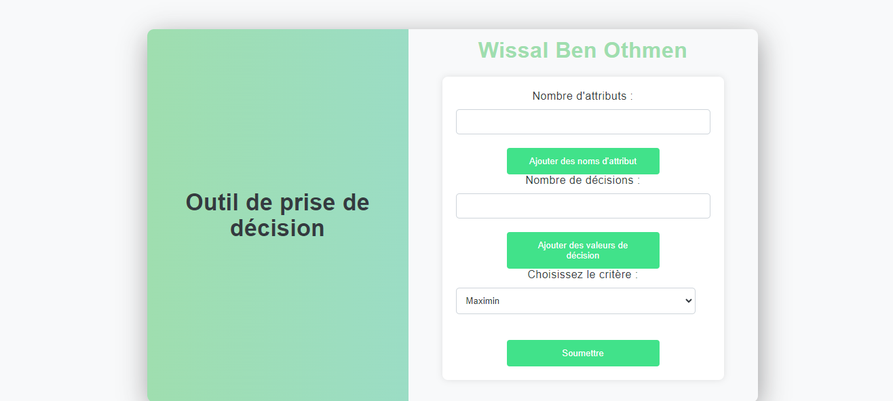
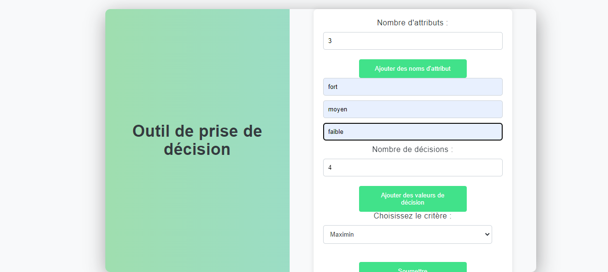

## Portfolio Personnel

Bienvenue sur le dépôt de mon portfolio ! Ici, vous pouvez explorer mes compétences, mes projets et mon parcours professionnel. Découvrez mes réalisations remarquables et explorez des opportunités passionnantes de collaboration. Ce dépôt est également réservé aux projets confidentiels et personnels, offrant des descriptions détaillées et des captures d'écran pour référence. Merci de votre visite !

## Fonctionnalités

- **Présentation Visuelle :** Un design propre et moderne pour une expérience utilisateur agréable.
- **Projets :** Explorez mes projets passés et actuels avec des descriptions détaillées.
- **Compétences :** Une liste complète de mes compétences techniques et professionnelles.
- **Contact :** Restez en contact avec moi en utilisant les informations de contact fournies.

## Projets Terminés

### Projet 1 -> Web Scraper et Recommandation de Produits

Découvrez notre projet de web scraping, extrayant des informations de produits de divers sites de commerce électronique en Tunisie, notamment Mytek, Tunisianet et SBS Informatique. Les données extraites sont stockées dans une base de données MySQL, offrant des fonctionnalités telles que l'extraction de données, le stockage en base de données, la visualisation, le filtrage et la prédiction.

.png)
.png)
.png)
.png)
.png)
.png)

### Projet 2 -> 3ème Prix - Hackathon Airbnb et Jeux Olympiques 2024

Notre équipe a remporté le 3ème prix lors d'un hackathon axé sur Airbnb et les Jeux Olympiques de 2024. Le défi pour les équipes participantes était de proposer des améliorations à l'expérience utilisateur sur Airbnb, en intégrant l'analyse géographique, le traitement du langage naturel (NLP) et l'étude des profils d'hôtes. Notre approche comprenait la compréhension des préférences des voyageurs basées sur la localisation, les habitudes passées et les activités qu'ils apprécient dans une région spécifique, proposant des expériences adaptées aux intérêts des utilisateurs tout en tenant compte de facteurs tels que la météo, les événements sportifs et les activités touristiques développées autour d'eux. De plus, nous avons suggéré de mettre en œuvre une fonction de recherche basée sur le traitement du langage naturel (NLP) pour permettre aux utilisateurs de trouver des logements en utilisant des requêtes plus naturelles et conversationnelles. Nous avons également analysé les descriptions de liste et les avis des utilisateurs pour comprendre les caractéristiques et les commodités les plus importantes pour chaque voyageur, affinant ainsi les résultats de recherche en conséquence. Nous avons extrait les exigences demandées par les locataires et effectué une analyse sentimentale pour les catégoriser avec leurs exigences.

.png)
.png)
.png)

### Projet 3 -> Participation au Hackathon : Système de Gestion des Ressources Humaines Hospitalières avec Intégration de l'Apprentissage Automatique

Participation à un hackathon pour développer un système de gestion des ressources humaines (GRH) pour les hôpitaux, intégrant des modèles d'apprentissage automatique pour surveiller l'état des patients et prédire la probabilité de risques d'infections nosocomiales en temps réel.

.png.jpg)
.jpg)
.jpg)
.jpg)
.jpg)
.jpg)

### Projet 4 -> Recherche sur les Préférences d'Apprentissage des Étudiants

Dans le cadre de mon Master en Big Data et Intelligence Artificielle, j'ai mené une étude approfondie sur les préférences d'apprentissage des étudiants, incluant PCA, CA, MCA et des méthodes de classification telles que K-means et Ward. À l'aide de ces méthodes analytiques avancées, j'ai exploré les réponses globales à un questionnaire.

Caractéristiques clés :
- Analyse multidimensionnelle des styles d'apprentissage et des préférences pédagogiques (ACP, AFC, ACM).
- Utilisation de techniques de classification pour une exploration approfondie.
- Exploration visuelle des préférences dans les domaines d'études et les loisirs.
- Investigation des liens entre facteurs psychologiques et types d'intelligence.

- Mots-clés :
Préférences d'apprentissage, PCA, CA, MCA, Classification, Stratégies éducatives.

.png)
.png)
.png)
.png)

### Projet 5 -> Analyse et Sélection de Modèles pour la Prédiction de l'Antigène Spécifique de la Prostate (lpsa)

Ce projet vise à développer des modèles prédictifs précis et robustes pour prédire le niveau de l'antigène spécifique de la prostate (lpsa) à partir de diverses variables cliniques. PSA est un biomarqueur crucial utilisé pour évaluer le risque de cancer de la prostate. Les données utilisées proviennent de l'étude de Stamey et al. (1989) et comprennent des variables telles que le logarithme du volume du cancer, le logarithme du poids de la prostate, l'âge et d'autres caractéristiques cliniques pertinentes. Le projet commence par une phase d'exploration des données, incluant la visualisation des distributions, la vérification des valeurs manquantes et la normalisation des variables pour assurer la qualité des données avant la modélisation. Plusieurs techniques sont ensuite appliquées, notamment des modèles linéaires classiques, des méthodes de sélection de modèle, des techniques de régularisation (Ridge, Lasso, Elastic Net), ainsi que des régressions par moindres carrés partiels (PLS) et par composantes principales (PCR). Chaque méthode est évaluée avec différentes configurations pour assurer l'optimalité du modèle. Des techniques de validation croisée sont utilisées pour sélectionner les meilleurs hyperparamètres et évaluer les performances prédictives de chaque modèle. L'objectif est de comparer ces approches pour identifier la méthode la plus efficace et applicable dans un contexte clinique pour prédire le niveau de lpsa.

- Compétences : Apprentissage automatique.

.png)
.png)
.png)
.png)

## Project6 -> Model Analysis and Selection Project for Prostate-Specific Antigen (lpsa) Prediction

This project aims to develop accurate and robust predictive models for predicting the level of prostate-specific antigen (lpsa) from various clinical variables. PSA is a crucial biomarker used to assess the risk of prostate cancer. The data used are from the study by Stamey et al. (1989) and include variables such as the log of cancer volume, log of prostate weight, age, and other relevant clinical features. The project begins with a data exploration phase, including visualization of distributions, checking for missing values, and normalization of variables to ensure data quality before modeling. Several techniques are then applied, including classical linear models, model selection methods, regularization techniques (Ridge, Lasso, Elastic Net), as well as partial least squares (PLS) and principal component regression (PCR). Each method is evaluated with different configurations to ensure model optimality. Cross-validation techniques are used to select the best hyperparameters and evaluate the predictive performances of each model. The goal is to compare these approaches to identify the most effective and applicable method in a clinical context for predicting lpsa level.This project aims to develop accurate and robust predictive models for predicting the level of prostate-specific antigen (lpsa) from various clinical variables. PSA is a crucial biomarker used to assess the risk of prostate cancer. The data used are from the study by Stamey et al. (1989) and include variables such as the log of cancer volume, log of prostate weight, age, and other relevant clinical features. The project begins with a data exploration phase, including visualization of distributions, checking for missing values, and normalization of variables to ensure data quality before modeling. Several techniques are then applied, including classical linear models, model selection methods, regularization techniques (Ridge, Lasso, Elastic Net), as well as partial least squares (PLS) and principal component regression (PCR). Each method is evaluated with different configurations to ensure model optimality. Cross-validation techniques are used to select the best hyperparameters and evaluate the predictive performances of each model. The goal is to compare these approaches to identify the most effective and applicable method in a clinical context for predicting lpsa level.
Skills: Machine Learning

.png)
.png)
.png)
.png)

## Project7 -> Model Analysis and Selection Project for Prostate-Specific Antigen (lpsa) Prediction

This study compares various algorithms for solving the N-Queens problem, a classic problem in artificial intelligence. The N-Queens problem involves placing N queens on an N × N chessboard such that no two queens threaten each other, according to the rules of chess. The problem is formalized as a Constraint Satisfaction Problem (CSP).

Objectives:

Formalize the N-Queens problem as a CSP.
Implement and compare the AC3 algorithm, depth-first search with backtracking, and Forward checking algorithm.
Analyze the results and draw conclusions.This study compares various algorithms for solving the N-Queens problem, a classic problem in artificial intelligence. The N-Queens problem involves placing N queens on an N × N chessboard such that no two queens threaten each other, according to the rules of chess. The problem is formalized as a Constraint Satisfaction Problem (CSP). Objectives: Formalize the N-Queens problem as a CSP. Implement and compare the AC3 algorithm, depth-first search with backtracking, and Forward checking algorithm. Analyze the results and draw conclusions.
Skills: Artificial Intelligence (AI) · Algorithms

.png)
.png)
.png)
.png)
.png)

## Project8 -> Q-Learning Algorithm Implementation for Maze Solving

This project, part of the Big Data and Artificial Intelligence Master's program, focuses on implementing the Q-learning algorithm to solve maze problems. The objective is to train an agent to find the shortest path from a starting point to an exit point in a maze, while avoiding walls. The project involves creating the maze structure, defining states, actions, rewards, and algorithm parameters, training the agent using Q-learning, and validating its ability to find optimal paths in various maze configurations.This project, part of the Big Data and Artificial Intelligence Master's program, focuses on implementing the Q-learning algorithm to solve maze problems. The objective is to train an agent to find the shortest path from a starting point to an exit point in a maze, while avoiding walls. The project involves creating the maze structure, defining states, actions, rewards, and algorithm parameters, training the agent using Q-learning, and validating its ability to find optimal paths in various maze configurations.
Skills: Reinforcement Learning

.png)
.png)
.png)
.png)

## Project9 -> Top 5% in Kaggle Competition - House Prices Prediction

Participated in a Kaggle competition for predicting house prices in Ames, Iowa, using 79 explanatory variables. Ranked 240th out of 4841 participants, in the top 5% of competitors. Implemented data preprocessing techniques including handling missing values and outliers, featuring engineering, and used various advanced regression models. Additionally, applied stacking and blending techniques with models such as ElasticNet, Lasso, Ridge, SVR, GradientBoosting, XGBoost, and LightGBM for predictions.

.png)
.png)
.png)

## Project10 -> Decision-Making Tool under Uncertainty: A Python Flask Web Application

This project, developed during my university studies, involved creating a web application using Python Flask to aid in decision-making under uncertainty. The tool allows users to input decision criteria and weights for each criterion. It then computes the decision outcome using methods such as maximin, maximax, Laplace, Bernoulli, Hurwicz, and minimax regret. This enables users to compare outcomes and make informed decisions.This project, developed during my university studies, involved creating a web application using Python Flask to aid in decision-making under uncertainty. The tool allows users to input decision criteria and weights for each criterion. It then computes the decision outcome using methods such as maximin, maximax, Laplace, Bernoulli, Hurwicz, and minimax regret. This enables users to compare outcomes and make informed decisions.
Skills: Decision-Making 

## Project11 -> Hackathon Participation: Hospital Human Resources Management System with Machine Learning Integrationon

Participated in a hackathon to develop a Human Resources Management (HRM) system for hospitals, integrating machine learning models to monitor patient status and predict the probability of nosocomial infection risks in real time.Participated in a hackathon to develop a Human Resources Management (HRM) system for hospitals, integrating machine learning models to monitor patient status and predict the probability of nosocomial infection risks in real time.
Skills: Machine Learning · Laravel · Teamwork · Team Leadership

.png.jpg)
.jpg)
.jpg)
.jpg)
.jpg)
.jpg)

## Project12 -> 3rd Prize Winners - Airbnb and 2024 Olympic Games Hackathon

Our team was awarded the 3rd prize at a hackathon focused on Airbnb and the 2024 Olympic Games. The challenge for participating teams was to propose improvements to the user experience on Airbnb, integrating Geographic Analysis, Natural Language Processing (NLP), and Host Profile Study. Our approach included understanding travelers' preferences based on location, past habits, and activities they enjoyed in a specific region, proposing experiences tailored to user interests while considering factors such as weather, sports events, and tourist activities developed around them. Additionally, we suggested implementing a search function based on Natural Language Processing (NLP) to allow users to find accommodations using more natural and conversational queries. We also analyzed listing descriptions and user reviews to understand the most important features and amenities for each traveler, refining search results accordingly. We extracted the requirements requested by the tenants and conducted a sentimental analysis to categorize them with their requirements

.png)
.png)
.png)

Thank you for visiting the "MyProjects" section of my portfolio repository! If you have any questions or if there's a project you'd like to explore further, feel free to reach out. Your interest is greatly appreciated!
